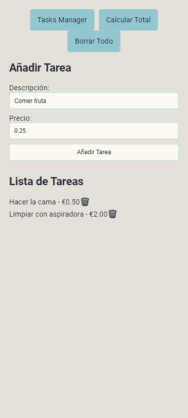

# :memo:Tasks Manager Web
Simple tasks manager made with [Vite](https://vitejs.dev/), [React](https://react.dev/) and [TypeScript](https://www.typescriptlang.org/).

##### SUPPORTS MOBILE AND COMPUTERS

## :camera:Images

###  Contact
Discord: `3xotic.`

### :card_index:License
GNU General Public License v3.0 ([here](LICENSE)).